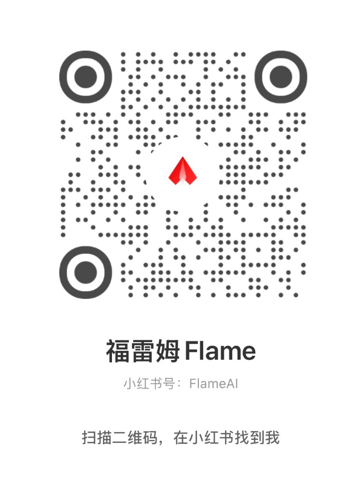

# He Tu & Luo Shu — Structural Visualization
# 河图 · 洛书 · 数理结构可视化

A visual and interactive exploration of the **He Tu (河图)** and **Luo Shu (洛书)** system,
focusing on their numerical structure, spatial order, and symbolic relationships.

This project does **not** aim at fortune-telling or prediction.
Instead, it presents He Tu and Luo Shu as **structural and symbolic systems** that can be observed, studied, and interpreted.

本项目是对中国传统数理体系 **河图、洛书** 的可视化与交互探索，
重点放在 **数理结构、空间秩序与象征关系** 上。

项目本身**不提供吉凶判断，也不做预测结论**，
而是提供一种可被观察、理解与再诠释的结构呈现。


### [🚀 Live Demo Used (在线体验)](https://flameaistudio.github.io/HeTu-LuoShu-3D/)

---

## ✨ What This Project Is | 项目说明

**English**

> "If He Tu is not just a static map, but a running 3D system, what would it look like?"

- A 3D visualization of the He Tu and Luo Shu structures
- Interactive exploration of spatial relationships and numeric flows
- Visual emphasis on balance, symmetry, and cosmic order
- Demonstrates how the structure evolves into **Tai Chi modes** and **Double Helix patterns**, representing energy orbiting a center.
- Treated as a **structural and symbolic system**

**中文**

> “如果河图不是一张图，而是一个在运行的立体系统，会是什么样？”

- 河图与洛书结构的 3D 可视化呈现
- 交互式探索空间关系与数理流转
- 强调平衡、对称与宇宙秩序之美
- 展示结构如何自然演化为 **太极模式** 与 **双螺旋模式**，呈现能量围绕中心运行的状态
- 将其视为一种 **数理与象征系统**

---

## 👀 Preview | 预览

| He Tu (河图) | Luo Shu (洛书) |
| :---: | :---: |
|  |  |

## 🧠 Design Philosophy | 设计理念

**English**

This project is an AI-assisted 3D exploration based on traditional mnemonics and spatial structures. It approaches He Tu and Luo Shu as:

- A dynamic spatial model of **Yin-Yang, Five Elements, and energy flow**, not just a static image
- Mathematical structures and early systems thinking
- An experimental 3D interpretation based on personal understanding

**"This is not the only solution, but a possible perspective."**

The expression of traditional culture has a long way to go. If this attempt can offer a spark of inspiration or resonance, I am willing to be **"a small stone on the path of the wise."**

**中文**

本项目是利用 AI 辅助，结合传统口诀与空间结构做的一次 **3D 立体化尝试**。我们将河图、洛书理解为：

- 一套关于 **阴阳、五行、能量生成与流动** 的空间模型，而非静态影像
- 数学结构与早期系统性思维的体现
- 基于个人理解的一种探索性尝试

**“这个视频并不是在给出‘唯一思路’，只是提供一种可能的视角。”**

传统文化的表达本就任重道远，需要更多不同角度的探索与交流。如果这次尝试，能在某些人的理解过程中起到一点推动作用，**“我愿意做智者前进路上的一颗小石子”**。

---

## 🧓 A Note for Traditional Learners
## 🧓 给传统文化学习者的一点说明

**English**

If you study *I Ching*, *He Tu*, *Luo Shu*, or related traditional systems,
you are welcome to interpret the structures and visual relationships in this project through your own theoretical framework.

This project does not deny traditional interpretations,
nor does it claim authority over them.

It simply provides a **visual and structural reference**.

**中文**

如果你长期学习《易经》、河图、洛书或相关传统体系，
可以完全按照你熟悉的理论框架来理解本项目中的结构与呈现方式。

本项目既不否定传统解读，
也不对任何解读方式作权威判断，
而只是提供一种 **结构层面的可视化参考**。

---

## 🛠 Tech Stack | 技术栈

- **Core**: React, TypeScript
- **3D Engine**: Three.js, @react-three/fiber, @react-three/drei
- **Build Tool**: Vite
- **Styling**: Tailwind CSS

纯前端 3D 可视化实现，无后端、无数据收集。

---

## ▶️ How to Run | 运行方式

**Prerequisites / 前置要求**: Node.js

1. Clone or download this repository
   克隆或下载本仓库

2. Install dependencies
   安装依赖
   ```bash
   npm install
   ```

3. Run the development server
   启动开发服务器
   ```bash
   npm run dev
   ```

4. Observe and interact with the grid in your browser
   在浏览器中观察体验

---

## 📂 Project Structure | 项目结构

```
.
├─ App.tsx              # Main application logic / 主应用逻辑
├─ components/
│  ├─ HeTuScene.tsx     # He Tu 3D Scene / 河图场景
│  └─ LoShuScene.tsx    # Luo Shu 3D Scene / 洛书场景
├─ constants.ts         # Coordinate & Data definitions / 数据与坐标定义
├─ types.ts             # TypeScript definitions / 类型定义
├─ index.html           # Entry point / 入口文件
├─ package.json         # Dependencies / 项目依赖
├─ vite.config.ts       # Vite configuration / Vite 配置
├─ README.md            # Documentation / 说明文档
└─ LICENSE              # OSS License / 开源协议
```

---

## 📜 License & Usage | 开源协议与初心

**MIT License**

**Note from the Author:**
I hope this source code serves as a tool for **education, dissemination, and inspiration**, helping more people explore traditional culture.
**Please do not sell this source code for profit.**
Let knowledge flow freely.

**作者寄语：**
开源这份代码，是希望它能真正用来 **传播、教学**，帮助更多人以现代化的视角接触传统文化。
**请勿将源代码直接进行商业售卖。**
愿这份“开源精神”与“传统智慧”一样，因分享而生生不息。

---

## 👤 About the Author | 作者

**Flame (FlameAIStudio)**

🏷️ **Global Indie Dev | AI Explorer | Traditional Culture Enthusiast | ENTP**
✍️ **Dev Logs | Growth Insights | AI Experiments | Daily Inspiration**

🏷️ **出海开发者｜AI探索者｜传统文化爱好者｜ENTP**
✍️ **开发实录｜增长复盘｜AI实验｜日常灵感**

- [](https://github.com/FlameAIStudio)
- [](https://www.flameai.net/)
- [](https://xhslink.com/m/4hpU0mLDqkm)
- [](https://v.douyin.com/wdahg7Imp6M/)


<table>
  <tr>
    <td align="center">
      
      <br />
      公众号
    </td>
    <td align="center">
      
      <br />
      抖音
    </td>
    <td align="center">
      
      <br />
      小红书
    </td>
  </tr>
</table>

